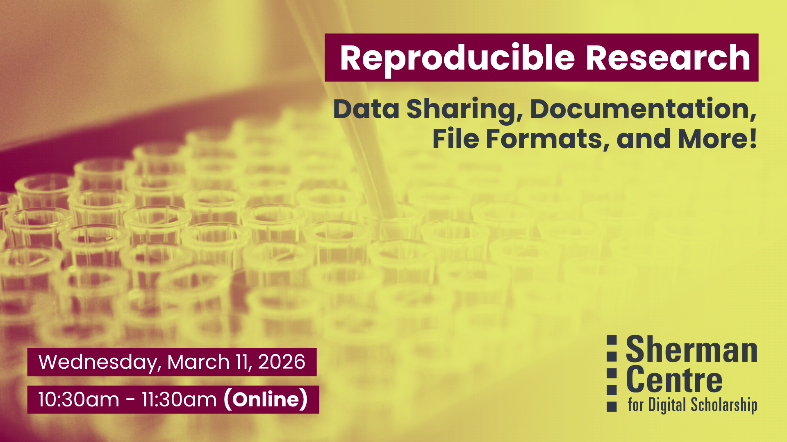

# Reproducible Research: Data Sharing, Documentation, File Formats, and More!

## Workshop Preparation 

None

## Facilitator Bio

Isaac Pratt (he/him) is a research scientist by training and has a PhD in Anatomy & Cell Biology. He leverages nearly a decade of interdisciplinary research experience to help support students, staff, and faculty. His expertise lies in questions surrounding data storage, security, planning, archival, and sharing. Isaac also provides support and curation services for McMaster Dataverse. His other interests include reproducible research methods, open science, and data science.

## Workshop Slides

Coming soon.

<!-- <embed src="assets/docs/Creating-and-Sharing-Maps-with-ArcGIS-Online.pdf" style="border:none;" width="100%" height="466px">

[Download as PDF.](assets/docs/Creating-and-Sharing-Maps-with-ArcGIS-Online.pdf)-->
