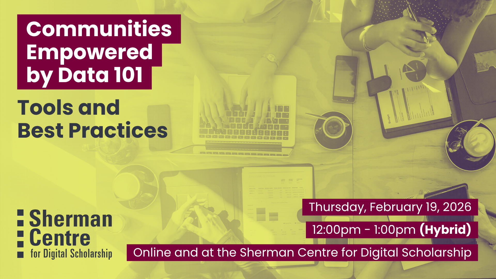

# Communities Empowered by Data 101

Community-led data practices empower and support community-led grassroots actions and initiatives. Data are valuable and we need to work together to take care of them, from the initial planning stages of a project to where it lives after the work is complete. In this 101-level session, we’ll introduce the Community Research Data Toolkit—a new Pressbook filled with guidance and resources to support communities in taking an active role in data management. Topics include using data management plans as tools for building trust, exploring options for long-term community-held data, and more. Following an interactive overview, we'll save some time to workshop challenges and possibilities through a set of applicable case studies.

Participants will learn to:
- Summarize RDM best practices and what Data Management Plans and Data Deposit look like in community-based research
- Locate available tools, training, and guidance
- Appraise the tools and prepare to implement Community control for data in your work. 

This session is designed for non-profits, activists, community organizations, and the researchers and data professionals who work with them!

## Workshop Preparation 

None

## Facilitator Bio

Danica Evering (they/them) is a Research Data Management Specialist grounded in curiosity and a deep commitment to ethics. Danica is available to help students, postdocs, faculty, and staff with RDM through the data lifecycle—Data Management Plans, storage and backup, data security, data sharing. With an MA in Media Studies, Danica fosters active interest in RDM across disciplines, with a knack for engaging researchers who might not even realize they have data to manage. Outside of work they sing in a choir, play PC games, maintain an art writing practice, grow a garden, contribute Wikipedia articles, and run. 

Subhanya (she/her) brings a background of research in data justice, science and technology studies, and environmental humanities. She is currently thinking through participatory data design which allow for visualizations that are empowering for the end user.

Isaac Pratt (he/him) is a research scientist by training and has a PhD in Anatomy & Cell Biology. He leverages nearly a decade of interdisciplinary research experience to help support students, staff, and faculty. His expertise lies in questions surrounding data storage, security, planning, archival, and sharing. Isaac also provides support and curation services for McMaster Dataverse. His other interests include reproducible research methods, open science, and data science.

## Workshop Slides

Coming soon.

<!-- <embed src="assets/docs/Creating-and-Sharing-Maps-with-ArcGIS-Online.pdf" style="border:none;" width="100%" height="466px">

[Download as PDF.](assets/docs/Creating-and-Sharing-Maps-with-ArcGIS-Online.pdf)-->
