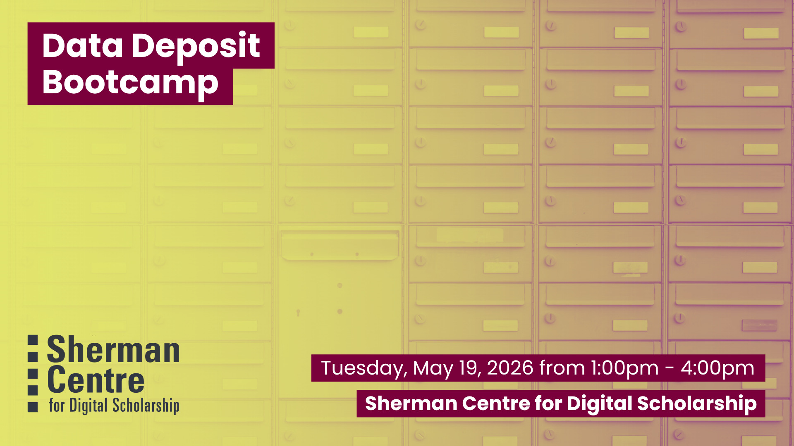

# Data Deposit Bootcamp (In-Person)

Data deposit and data sharing are increasingly recognized as best practice to support open research, reproducibility, research integrity, collaboration, and more. Disciplines, funders, and journals are increasingly requiring researchers to share or deposit data. But how do you get your dataset ready for sharing? What's the best repository to share it in? With light snacks and refreshments to sustain you and specialists on-hand to answer any questions, you'll end this session with ready-to-submit data...or submitted or even published data!

By the end of this 3-hour session, you will be able to: 
- Identify the appropriate repository for their dataset.
- Outline documentation and metadata best practices 
- Develop a README file that thoroughly describes the dataset being deposited.
- Organize datasets in preparation for data deposit, including metadata entry.

If you have a dataset that's ready for deposit or that you'd like to get deposit ready, bring it along. No dataset? No problem! We have a sample dataset you can use to go through the process and learn how to deposit data. 

This session is ideal for researchers, staff, and students preparing to share data for a publication, grant, or project—and for anyone interested in open data best practices. Graduate students who have completed their thesis work are especially encouraged to attend!  Pair this with our Data Management Plan Bootcamp May 12, 2026 for a spring research data management intensive for graduate researchers and research staff. 

## Workshop Preparation 

If you have a dataset ready to submit, bring it along! No dataset, no problems--we have a sample dataset you can use to go through the process and learn how to deposit data.

## Facilitator Bio

Isaac Pratt (he/him) is a research scientist by training and has a PhD in Anatomy & Cell Biology. He leverages nearly a decade of interdisciplinary research experience to help support students, staff, and faculty. His expertise lies in questions surrounding data storage, security, planning, archival, and sharing. Isaac also provides support and curation services for McMaster Dataverse. His other interests include reproducible research methods, open science, and data science.

Danica Evering (they/them) is a Research Data Management Specialist grounded in curiosity and a deep commitment to ethics. Danica is available to help students, postdocs, faculty, and staff with RDM through the data lifecycle—Data Management Plans, storage and backup, data security, data sharing. With an MA in Media Studies, Danica fosters active interest in RDM across disciplines, with a knack for engaging researchers who might not even realize they have data to manage. Outside of work they sing in a choir, play PC games, maintain an art writing practice, grow a garden, contribute Wikipedia articles, and run. 

## Workshop Slides

Coming soon.

<!-- <embed src="assets/docs/Creating-and-Sharing-Maps-with-ArcGIS-Online.pdf" style="border:none;" width="100%" height="466px">

[Download as PDF.](assets/docs/Creating-and-Sharing-Maps-with-ArcGIS-Online.pdf)-->
