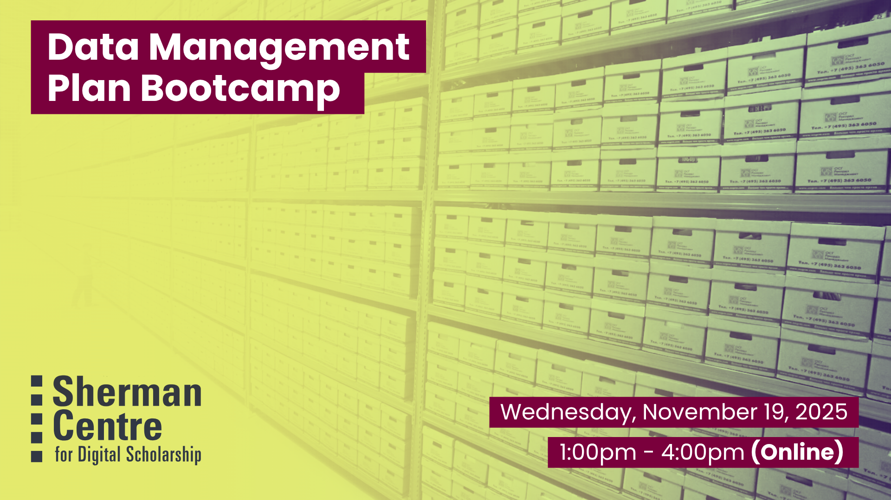

# Data Management Plan Bootcamp

Our popular DMP Bootcamp is back, reformatted into a hands-on online intensive for remote researchers on the go! Data Management Plans (DMPs) are both incredibly helpful research tools and increasingly required for grants but it can hard to know how to complete a Data Management Plan if it’s your first time. This session is carefully timed for researchers completing a CFI or Tri-Agency grant. If you're in the process of creating a DMP, either for a grant application or for your own research, join RDM Services for this afternoon session. The RDM Services team will provide tailored guidance as you write your plan online--we'll pop into your breakout rooms to make sure everything is going smoothy. Come away with a clear path forward or even a finished DMP! 

By the end of this session, participants will be able to:
- Identify the 5 key components of a data management plan (DMP).
- Compare strong and weak responses in each section of a DMP.
- Develop a tailored outline, or potentially a complete draft, of their own DMP!

This participatory session is especially relevant for researchers at all levels in the beginning stages of a research project or streamlining best practices for their research team. Come on your own, send your research staff, or bring your whole research group. Let us know if you're joining as a research team - we'll make sure you get an online breakout room to work together in! Bring your own snacks to your desk and enjoy this dedicated time to work on your plan with extra support. 

## Workshop Preparation 

None

## Facilitator Bio

Danica Evering holds expansive experience with research support, education, project management, advocacy, and knowledge translation; with fluency in social practice art, healthcare, community research, data, and systems development. Danica supports students, postdocs, faculty, and staff with RDM through the data lifecycle—Data Management Plans, storage and backup, data security, data sharing. With an MA in Media Studies from Concordia, they are interested in fostering RDM within curious scholars and disciplines.

## Workshop Slides

Coming soon.

<!-- <embed src="assets/docs/Creating-and-Sharing-Maps-with-ArcGIS-Online.pdf" style="border:none;" width="100%" height="466px">

[Download as PDF.](assets/docs/Creating-and-Sharing-Maps-with-ArcGIS-Online.pdf)-->
