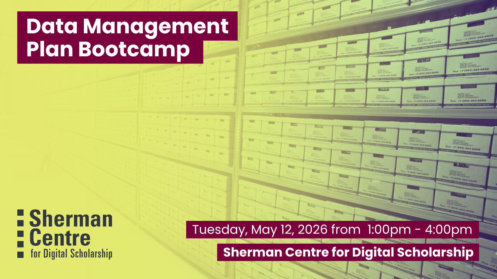

# Data Management Plan Bootcamp

Let us be your body double with this in-person bootcamp! Data Management Plans (DMPs) are both incredibly helpful research tools and increasingly required for grants but it can hard to know how to complete a Data Management Plan if it’s your first time.  If you're in the process of creating a DMP, either for a grant application or for your own research, join RDM Services for this afternoon session. The RDM services team will provide tailored guidance as you write your plan on site, and we'll have some light snacks and refreshments to keep you going. Come away with a clear path forward or even a finished DMP! 

By the end of this session, participants will be able to:
- Identify the 5 key components of a data management plan (DMP).
- Compare strong and weak responses in each section of a DMP.
- Develop a tailored outline, or potentially a complete draft, of their own DMP!

This participatory session is especially relevant for researchers at all levels in the beginning stages of a research project or streamlining best practices for their research team. Pair this with our Data Deposit Bootcamp May 19, 2026 for a spring research data management intensive for graduate researchers and research staff. Come on your own, send your research staff, or bring your whole research group. Let us know if you're joining as a research team - we'll make sure you get a table to work together at! 

## Workshop Preparation 

None

## Facilitator Bio

Isaac Pratt (he/him) is a research scientist by training and has a PhD in Anatomy & Cell Biology. He leverages nearly a decade of interdisciplinary research experience to help support students, staff, and faculty. His expertise lies in questions surrounding data storage, security, planning, archival, and sharing. Isaac also provides support and curation services for McMaster Dataverse. His other interests include reproducible research methods, open science, and data science.

Danica Evering holds expansive experience with research support, education, project management, advocacy, and knowledge translation; with fluency in social practice art, healthcare, community research, data, and systems development. Danica supports students, postdocs, faculty, and staff with RDM through the data lifecycle—Data Management Plans, storage and backup, data security, data sharing. With an MA in Media Studies from Concordia, they are interested in fostering RDM within curious scholars and disciplines.

## Workshop Slides

Coming soon.

<!-- <embed src="assets/docs/Creating-and-Sharing-Maps-with-ArcGIS-Online.pdf" style="border:none;" width="100%" height="466px">

[Download as PDF.](assets/docs/Creating-and-Sharing-Maps-with-ArcGIS-Online.pdf)-->
