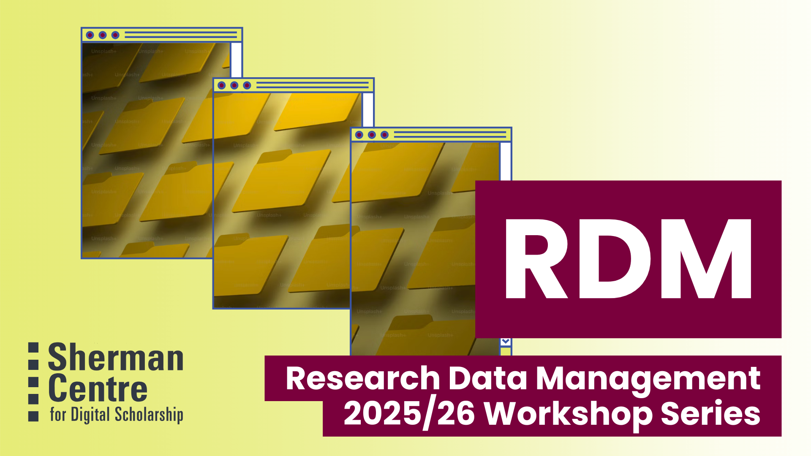



<!-- 
This will be the home page of your module. It should give a small introduction to the student about the workshop topic.
Add, edit, or remove any content below for the workshop in question. -->

<!-- Title slide image. Replace img src with your own, or comment this out. -->

<!-- Main header -->
# Welcome to Research Data Management (RDM): 2025-26 Webinars

Research Data Management (RDM) is about caring for data through the research lifecycle. RDM workshops help registrants with data management by providing training on:
* data management plans
* data deposit and sharing
* data storage and backup
* data security
* ethical and sensitive data management
* documentation and metadata

RDM workshops welcome students, staff, and faculty from any discipline, as well as the public at large. A number of RDM workshops are also geared towards beginners, so even if you’re new to data management, we encourage you to sign up and learn!

## 2025-2026 RDM Workshop Topics

  Workshops

<ul>


<li><a href="{{workshop.url | absolute_url}}">{{workshop.title}}</a></li>


</ul>

## Land Acknowledgement

RDM Services is based [Ohròn:wakon (in the ditch, ravine)](https://decolonialatlas.wordpress.com/2015/02/04/northeast-turtle-island-in-mohawk/), traditional territory the Mississauga and Haudenosaunee nations. We often hear about the Dish With One Spoon Wampum agreement, however that agreement is between the Anishinaabe and Haudenosaunee nations and does not include settlers. The [Silver Covenant Chain Wampum](https://www.onondaganation.org/history/2010/polishing-the-silver-covenant-chain-a-brief-history-of-some-of-the-symbols-and-metaphors-in-haudenosaunee-treaty-negotiations/), formalized alliances between the Indigenous people and European leadership across Canada and the US. In this place, part of the [1764 Treaty of Niagara](https://www.thecanadianencyclopedia.ca/en/article/treaty-of-niagara-1764), two figures connected by a silver chain, symbolizing friendship and alliance. The silver chain is stronger than iron, so it won't rust. However, it does carry responsibilities: it needs to be polished, lest it be tarnished. It is essential to Indigenous-Crown nation-to-nation relationships, mandating non-interference and the recognition of Indigenous sovereignty. 

In relation to research data management, researchers are responsible for essential protocols for Indigenous Data Sovereignty. Research by and with Indigenous data has additional protocols, and communities’ stakeholders are in control of preservation, custodianship, and any sharing. The First Nations Information Governance Centre’s [Fundamentals of OCAP® course](https://fnigc.ca/ocap-training/), which stands for Ownership, Control, Access, and Possession, gives a good introduction. Indigenous communities engaging in research should be involved in creating a Data Management Plan. Indigenous researchers and participants sharing or depositing data might be interested in the [Local Contexts Traditional Knowledge Labels](https://localcontexts.org/labels/traditional-knowledge-labels/)

Self-Governing Indigenous Governments have also developed a really useful [toolkit for Data Governance and Management](https://indigenousdatatoolkit.ca/). Locally, McMaster Indigenous Research Institute (MIRI) has a [McMaster Indigenous Research Primer](https://miri.mcmaster.ca/indigenous-research-primer/) which guides those who are engaging with Indigenous Peoples and their work.

