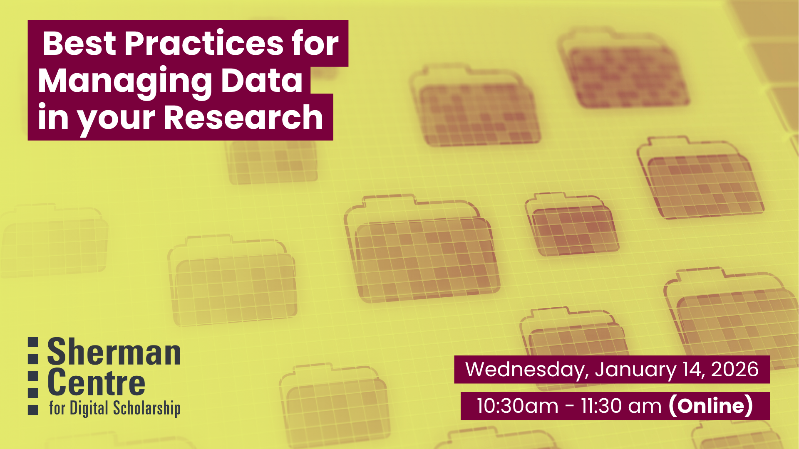

# Best Practices for Managing Data in your Research (Winter Term)

***TIFU (Today I F'ed Up) by losing a ton of data for my research*** - Have you ever seen a description like this on Reddit? Are your desktop and downloads folders a jumble of files named Data-finalFINAL-USETHISONE? Is all of your lab's data stored on a single drive located conveniently under a sprinkler system? Join research data management services and learn how investing a small amount of time in organizing your data now can save you a lot of time and prevent future headaches. In this introductory workshop, learn about research data management best practices. We will go over best practices for data planning, storage, organization, preservation, and sharing.

By the end of the session, participants will be empowered to: 
- Produce a plan for their data
- Organize and document their data consistently
- Store and back-up their data securely, 
- Select an appropriate data repository for archival and sharing.

No prior experience with data management is required! This session is perfect for anyone who wants to feel more confident organizing, storing, and sharing their data in clear and practical ways.

## Workshop Preparation 

None

## Facilitator Bio

Isaac Pratt (he/him) is a research scientist by training and has a PhD in Anatomy & Cell Biology. He leverages nearly a decade of interdisciplinary research experience to help support students, staff, and faculty. His expertise lies in questions surrounding data storage, security, planning, archival, and sharing. Isaac also provides support and curation services for McMaster Dataverse. His other interests include reproducible research methods, open science, and data science.

Danica Evering (they/them) is a Research Data Management Specialist grounded in curiosity and a deep commitment to ethics. Danica is available to help students, postdocs, faculty, and staff with RDM through the data lifecycle—Data Management Plans, storage and backup, data security, data sharing. With an MA in Media Studies, Danica fosters active interest in RDM across disciplines, with a knack for engaging researchers who might not even realize they have data to manage. Outside of work they sing in a choir, play PC games, maintain an art writing practice, grow a garden, contribute Wikipedia articles, and run. 
## Workshop Slides

Coming soon.

<!-- <embed src="assets/docs/Creating-and-Sharing-Maps-with-ArcGIS-Online.pdf" style="border:none;" width="100%" height="466px">

[Download as PDF.](assets/docs/Creating-and-Sharing-Maps-with-ArcGIS-Online.pdf)-->
