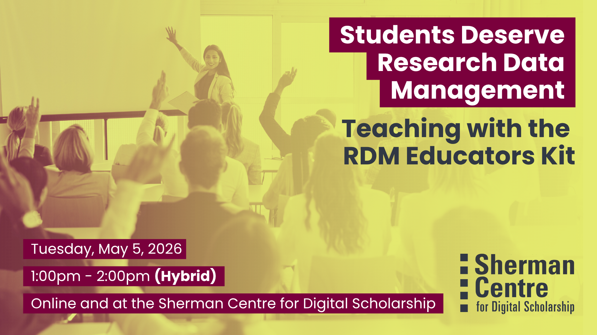

# Students Deserve Research Data Management! Teaching with the RDM Educators Kit

Your students deserve to know about Research Data Management! In this brand-new "train the trainer" session for educators, RDM Services will prepare you to prepare your graduate and undergraduate students for increasing grant and publisher requirements for Data Management Plans and Data Deposit.  

"Do my students even have data to manage?" you might ask. Au contraire mon capitane, they do! If research involves biological samples or survey results, you may feel confident you’re working with research data. But what if your research is rooted in creative practice? What if you’re looking for the specific heat of a material under a magnetic field? Data have many formats: text, numbers, images, recordings, software, algorithms, workflows. Research Data Management is caring for data through the research lifecycle: planning to archiving.

We'll discuss integrating our new RDM Educators Kit in the classroom, from 2-minute slide inserts to RDM class visits to multi-class Data Management Plan creation as an "open hand of cards." We'll end with a working session to imagine challenges and possibilities!

Participants will learn to:
- Summarize RDM best practices and what Data Management Plans and Data Deposit look like in your field
- Locate available tools from RDM Services
- Prepare to implement Research Data Management tools in the classroom.

This session is great for educators from faculty to sessional instructors to graduate students ready to bring RDM into their classrooms! 

## Workshop Preparation 

None

## Facilitator Bio

Isaac Pratt (he/him) is a research scientist by training and has a PhD in Anatomy & Cell Biology. He leverages nearly a decade of interdisciplinary research experience to help support students, staff, and faculty. His expertise lies in questions surrounding data storage, security, planning, archival, and sharing. Isaac also provides support and curation services for McMaster Dataverse. His other interests include reproducible research methods, open science, and data science.

Danica Evering (they/them) is a Research Data Management Specialist grounded in curiosity and a deep commitment to ethics. Danica is available to help students, postdocs, faculty, and staff with RDM through the data lifecycle—Data Management Plans, storage and backup, data security, data sharing. With an MA in Media Studies, Danica fosters active interest in RDM across disciplines, with a knack for engaging researchers who might not even realize they have data to manage. Outside of work they sing in a choir, play PC games, maintain an art writing practice, grow a garden, contribute Wikipedia articles, and run.

## Workshop Slides

Coming soon.

<!-- <embed src="assets/docs/Creating-and-Sharing-Maps-with-ArcGIS-Online.pdf" style="border:none;" width="100%" height="466px">

[Download as PDF.](assets/docs/Creating-and-Sharing-Maps-with-ArcGIS-Online.pdf)-->
